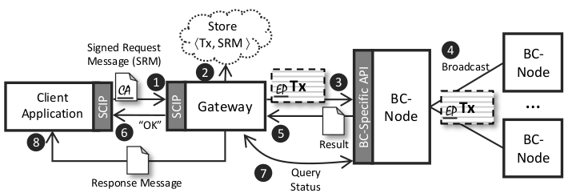
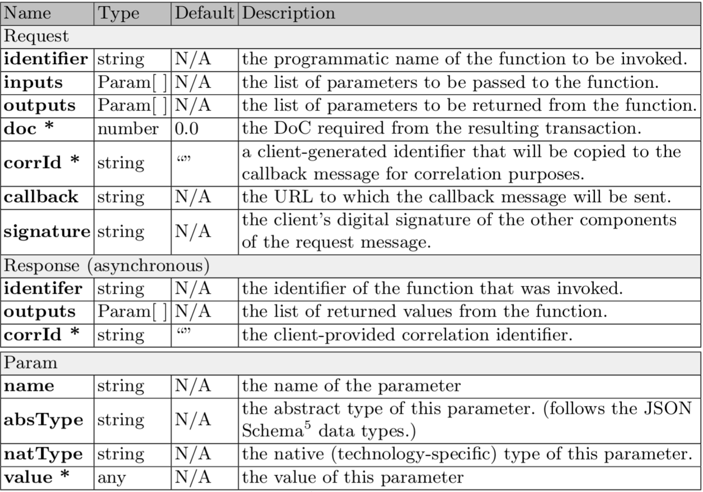
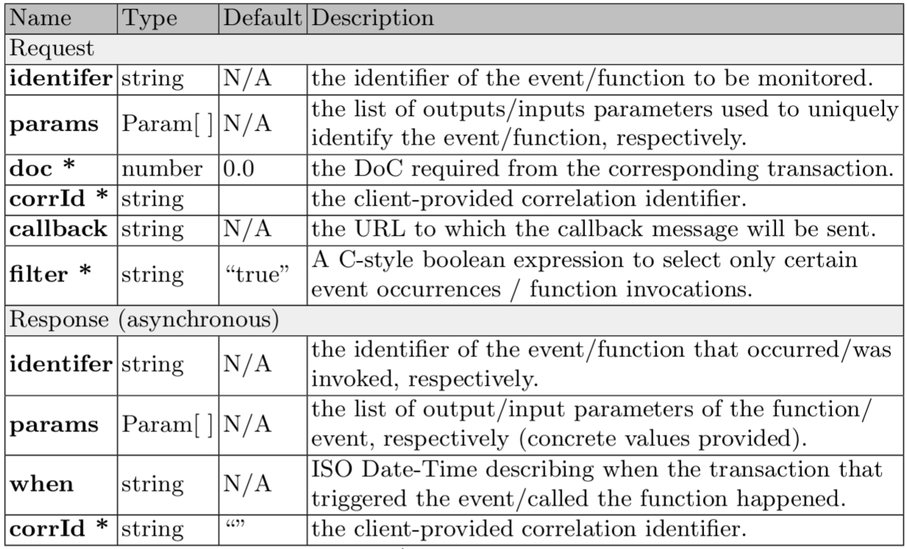
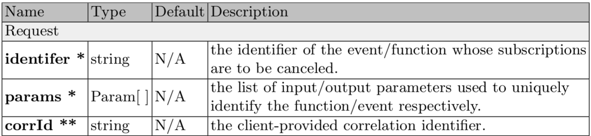
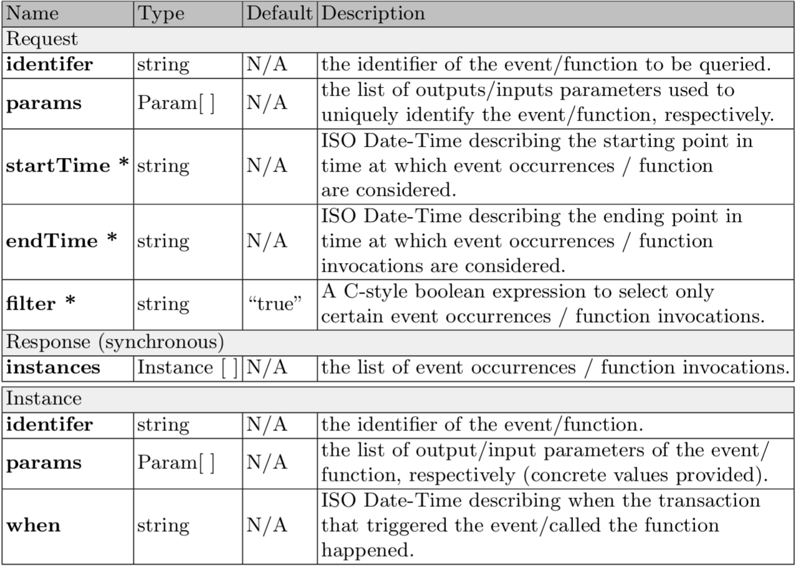

# Smart Contract Invocation Protocol (SCIP)

**Version**: 1.0.0

**Date**: November 7, 2019

**Author**:
   Ghareeb Falazi
   Uwe Breitenbücher
   Florian Daniel
   Andrea Lamparelli
   Frank Leymann

## Introduction
This document specifies the Smart Contract Invocation Protocol (SCIP) natural evolvement of the Smart Contract Locator ([SCL](https://bit.ly/2WRXvCZ)), intended to provide a protocol specification in the context of blockchains integration that allows external consumer applications to invoke smart contract functions in a uniform manner regardless of the underlying blockchain technology. Moreover it provides the capability to monitor smart contracts at runtime. The protocol assumes that the underlying blockchain technology is compatible with the Smart Contract Description Language ([SCDL](https://bit.ly/2JZUA5S))

## Protocol Specification
The protocol defines a total of six methods that can be grouped into three categories:
* *Invocation of smart contracts function.*
* *Live-monitoring of function invocation and event occurrences.*
* *Querying of past invocations and events*

### Function Invocation

This category includes one single method, called ***InvokeFunction***, which is used to allow an external application to invoke a specific smart contract function. Figure 1 shows the steps taken by client application and gateway when this method is triggered: The client formulates an *InvokeFunction* request message (i) in according to the structure defined in table 1.

<figure>
    
    <figcaption><strong>Figure 1</strong>  -  Steps performed by client and gateway during the execution of *InvokeFunction* method</figcaption>
</figure>

Once the message is formulated the client has to sign it using the algorithm  "SHA256withECDSA" and the normative curve "secp256k1", and then send it to the SCIP gateway. At this point the gateway formulates a blockchain (technology-specific) transaction out of the request message (using the **identifier**, and **params** fields), and signs it on behalf of the client application. Afterwords it stored the pair defined by the signed transaction (Tx) and the Signed Request Message (SRM) for the purpose of non-repudiation (ii) . The SRM exchange is mandatory whether the client and the gateway are managed by two different entities, otherwise it is not yet necessary. Once the transaction is formulated and signed, the gateway sends it to a blockchain node using its API (iii). The node, then, validates it, by executing the target smart contract function locally, and start the consensus process by announcing it  to the network of nodes (iv). Afterwords, it assigns a unique identifier to the transaction, and informs the gateway about it along the potential output values (v). Afterwords, the gateway informs the client application about the successful submission of the transaction (synchronous response to the original client request (i)) (vi), and at the same time, starts querying the blockchain node about the status of the transaction (vii). If the transaction receives enough confidence, in according to the **doc** field of the request message before the **timeout** is reached,  the gateway sends an asynchronous message to the address specified in **callback** field containing the execution results (viii).

Table 1

<figure>
    
    <figcaption><strong>Table 1</strong>  -  The structure of the <i>InvokeFunction</i> request and response message</figcaption>
</figure>

### Live Monitoring

This category includes methods that facilitate the live monitoring of interesting proceedings related to the invocation and execution of smart contracts functions. In particular the ***SubscribeToEvent*** method allows client to receive notification regarding the occurrences of specific custom- or system-defined events that are emitted during the execution of smart contract functions, whereas ***SubscribeToFunction*** method allows client to receive notification regarding the invocation of a specific smart contract function. In order to trigger one of these methods the client has to send to the gateway a request structured as state in table 2. Basically each subscription is identified by the the following tuple <*type, identifier, params, corrId*> where the *type* indicates whether it is an event- or function-subscription.

<figure>
    
    <figcaption><strong>Table 2</strong>  -  The structure of the <i>SubscribeToEvent</i> and <i>SubscribeToFunction</i> request and response messages</figcaption>
</figure>

Obviously for each subscription method there exist a respective cancel one, hence the methods are ***CancelEventSubscription*** and ***CancelFunctionSubscription*** that allow client to explicitly cancel a subscriptions previously created with the appropriate invocation to *SubscribeToEvent* and *SubscribeToFunction* respectively. A cancel subscription method can be used in four different ways in according to which fields are provided by the client in  the request structure (as defined in table 3): (i) when only **identifier** and **params** are present, then all corresponding event/function subscriptions are cancelled; (ii) when only a correlation identifier (**corrId**) is provided then all event/function subscription that correspond to it are cancelled; (iii) when all components are present, then the single event/function subscription that corresponds to them is cancelled; (iv) finally, when none of them is present, then all event/function subscriptions of this specific client are cancelled.

<figure>
    
    <figcaption><strong>Table 3</strong>  -  The structure of the <i>CancelEventSubscription</i> and <i>CancelFunctionSubscription</i> request message.</figcaption>
</figure>

### Querying

The methods in this category allow a client application to query the previous occurrences of an event or the previous invocation of a smart contract function, in particular these methods are called ***QueryEventOccurrences*** and ***QueryFunctionInvocations*** respectively. In order to trigger this kind of methods a client has to provide to the gateway a message structured as stated in table 4, once the request is received by the gateway, it scans the history of the blockchain and searches for event occurrences / function invocations with a prototype that matches the provided **identifier** and **params** fields. The client can even specify a time frame in which the search results should be considered and returned. Moreover, an optional **filter** can be specified in order to select only result that satisfy the filtering options. The filter is specified in the form of a C-style boolean expression that uses the outputs of the event / the inputs of the function invocation. These methods are fully synchronous because they don't need any blockchain transaction execution, hence a result is synchronously returned to the client application containing the list of event occurrences / function invocations found.

<figure>
    
    <figcaption><strong>Table 4</strong>  -  The structure of the <i>QueryEventOccurrences</i> and <i>QueryFunctionInvocations</i> request and response messages.</figcaption>
</figure>

## JSON-RPC Binding

