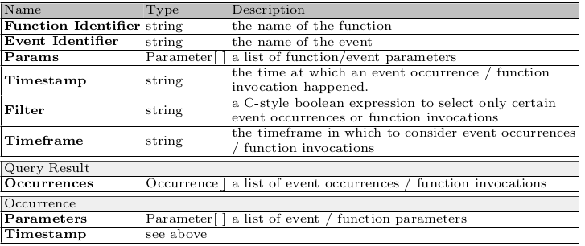
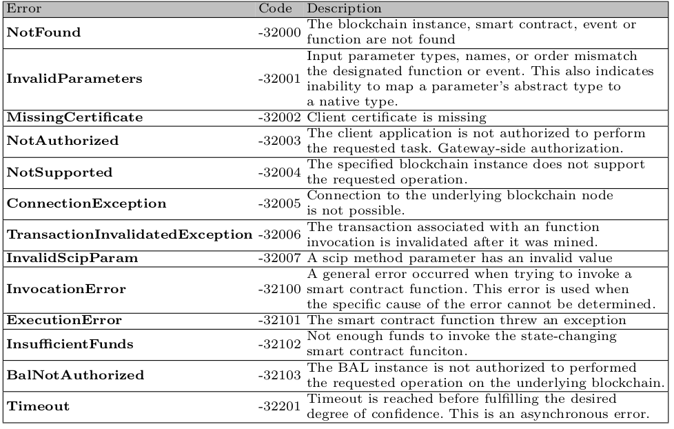

# Smart Contract Invocation Protocol (SCIP)

**Version**: 1.0.0

**Date**: November 7, 2019

**Author**:  
  Ghareeb Falazi  
  Uwe Breitenbücher  
  Florian Daniel  
  Andrea Lamparelli  
  Frank Leymann  

## Introduction
This document specifies the Smart Contract Invocation Protocol (SCIP) as natural evolvement of the Smart Contract Locator ([SCL](https://bit.ly/2WRXvCZ)), intended to provide a protocol specification in the context of blockchains integration that allows external consumer applications to invoke smart contract functions in a uniform manner regardless of the underlying blockchain technology. Moreover it provides the capability to monitor smart contracts at runtime. The protocol assumes that the underlying blockchain technology is compatible with the Smart Contract Description Language ([SCDL](https://bit.ly/2JZUA5S)). This core of the interface consists of a set of *methods* that can be used by blockchain-external consumer applications to interact with *smart contracts*. The methods are provided by an entity, called *gateway* (actual SCIP endpoint), which mediates between two or more different network technologies: the Internet and the blockchain networks. This gateway is reachable using the aforementioned *Smart Contract Locator* ([SCL](https://bit.ly/2WRXvCZ)), which uniquely identifies a smart contract outside the blockchain. We assume that client applications authenticate themselves with the gateway using OAuth 2.0, and that attacks like the Man-In-The-Middle (MITM) are thus prevented.

<br/>

## Protocol Specification
The protocol define a total of four different allowed methods:

* The *invocation* of a smart contract function
* The *subscription* to notifications regarding function invocations or event occurrences
* The *unsubscription* from live monitoring
* The *querying* of past invocations or events

Every method is associated to a specific request message, all of them can be found in **Figure 1**, which shows the metamodel of all four request and two response messages. . The bold boxes represent the SCIP messages, whereas the regular ones represent the message content fields. For readability, the metamodel is split into related sub-models.

<br/><br/>

<figure>
    
    <figcaption><strong>Figure 1</strong>  -  The metamodel of SCIP messages.</figcaption>
</figure>

All methods return a *synchronous* response message indicating the success or failure of the request, and some of them additionally return one or more *asynchronous* responses or errors. **Table 1** provides a detailed description of all call constructs defined in the previous metamodel.

<figure>
    
    <figcaption><strong>Table 1</strong>  -  Description of fields used in SCIP protocol.</figcaption>
</figure>

Some methods may require a point in time at which an event or a function took place, in this context the *time* refers to the UTC timestamp of the transaction that triggered the event or invoked the function. In particular the time is represented using the ISO 8601-1:2019 combined date and time representation. Certain other methods have a parameter called *degree of confidence* (DoC), which refers to the likelihood that a transaction included in a block will remain persistently stored on the blockchain. A value close to 1 means that the client application wants to receive the result only after ruling out the possibility that the block - including the transaction - may eventually be dropped from the blockchain, whereas a value close to 0 means that the client wants to receive the result as soon as it is available.


### Invocation

The invocation request is performed through the **Invoke** method, which allows an external application to invoke a specific smart contract function. The structure of the *Invocation* request message, as well as the asynchronous *Callback* message are explained in the **Figure 1a**. In particular this request message contains the name of the function and the list of input parameters, which allow to uniquely identify the specific function, a callback URL to which the gateway will send the asynchronous responses, a base64 encoding of the request message, and finally some optional fields like degree of confidence, correlation identifier, timeout and a list of output parameters that that specifies which parameters the client wants to receive as result from the function invocation (must be a subset of the actual return parameters of the function). A complete list of *Invocation Request* fields can be found in **Table 2**. A deeper description of how this request is handled by the gateway can be found in [invocation example](#step-by-step-invocation) section.

TODO: add table Invocation fields

### Subscription

This request is executed using the **Subscribe** method, in particular this request facilitates the live monitoring of smart contracts by allowing a client application to receive asynchronous notifications about event occurrences or smart contract function invocations. The structure of the message is described in **Figure 1b**, notice that exactly one field, between function identifier and event identifier, must be included. When receiving this specific request, the gateway identifies the designated event/function using the appropriate *identifier*, the field *parameters* further helps the gateway to differentiate between overloads. Then the gateway starts monitoring the event or function and whenever an occurrence is detected, the associated event outputs / function inputs are used to populate and evaluate the Boolean expression specified in the filter. If the expression returns *true* and the transaction causing the occurrence has reached the specified *degree of confidence*, a *Callback* (**Figure 1a**) message to the address specified in *callback URL* is issued. If a new subscription request is made by a client application with a correlation identifier already in
use, then the old subscription is cancelled and replaced with the new one. This could happen, e.g., if a client application wants to change the expression of the filter, the value of the degree of confidence, or the callback URL of an existing subscription.

TODO: add table subscription fields

### Unsubscription


### Querying


### Step by Step Invocation


### Invocation 

This category includes one single method, called ***InvokeFunction***, which is used to allow an external application to invoke a specific smart contract function. Figure 2 shows the steps taken by client application and gateway when this method is triggered: The client formulates an *InvokeFunction* request message (i) in according to the structure defined in Table 1.  

<br/>

<figure>
    
    <figcaption><strong>Figure 2</strong>  -  Steps performed by client and gateway during the execution of *InvokeFunction* method</figcaption>
</figure>

<br/><br/>

Once the message is formulated the client has to sign it using the algorithm  "SHA256withECDSA" and the normative curve "secp256k1", and then send it to the SCIP gateway. At this point the gateway formulates a blockchain (technology-specific) transaction out of the request message (using the **identifier**, and **params** fields), and signs it on behalf of the client application. Afterwords it stored the pair defined by the signed transaction (Tx) and the Signed Request Message (SRM) for the purpose of non-repudiation (ii) . The SRM exchange is mandatory whether the client and the gateway are managed by two different entities, otherwise it is not yet necessary. Once the transaction is formulated and signed, the gateway sends it to a blockchain node using its API (iii). The node, then, validates it, by executing the target smart contract function locally, and start the consensus process by announcing it  to the network of nodes (iv). Afterwords, it assigns a unique identifier to the transaction, and informs the gateway about it along the potential output values (v). Afterwords, the gateway informs the client application about the successful submission of the transaction (synchronous response to the original client request (i)) (vi), and at the same time, starts querying the blockchain node about the status of the transaction (vii). If the transaction receives enough confidence, in according to the **doc** field of the request message before the **timeout** is reached,  the gateway sends an asynchronous message to the address specified in **callback** field containing the execution results (viii).  

<br/>
<figure>
    
    <figcaption><strong>Table 1</strong>  -  The structure of the <i>InvokeFunction</i> request and response message</figcaption>
</figure>  
<br/>

### Live Monitoring

This category includes methods that facilitate the live monitoring of interesting proceedings related to the invocation and execution of smart contracts functions. In particular the ***SubscribeToEvent*** method allows client to receive notification regarding the occurrences of specific custom- or system-defined events that are emitted during the execution of smart contract functions, whereas ***SubscribeToFunction*** method allows client to receive notification regarding the invocation of a specific smart contract function. In order to trigger one of these methods the client has to send to the gateway a request structured as state in Table 2. Basically each subscription is identified by the the following tuple <*type, identifier, params, corrId*> where the *type* indicates whether it is an event- or function-subscription.  

<br/>
<figure>
    
    <figcaption><strong>Table 2</strong>  -  The structure of the <i>SubscribeToEvent</i> and <i>SubscribeToFunction</i> request and response messages</figcaption>
</figure>  
<br/><br/>

Obviously for each subscription method there exist a respective cancel one, hence the methods are ***CancelEventSubscription*** and ***CancelFunctionSubscription*** that allow client to explicitly cancel a subscriptions previously created with the appropriate invocation to *SubscribeToEvent* and *SubscribeToFunction* respectively. A cancel subscription method can be used in four different ways in according to which fields are provided by the client in  the request structure (as defined in Table 3): (i) when only **identifier** and **params** are present, then all corresponding event/function subscriptions are cancelled; (ii) when only a correlation identifier (**corrId**) is provided then all event/function subscription that correspond to it are cancelled; (iii) when all components are present, then the single event/function subscription that corresponds to them is cancelled; (iv) finally, when none of them is present, then all event/function subscriptions of this specific client are cancelled.  

<br/>
<figure>
    
    <figcaption><strong>Table 3</strong>  -  The structure of the <i>CancelEventSubscription</i> and <i>CancelFunctionSubscription</i> request message.</figcaption>
</figure>  
<br/><br/>


### Querying

The methods in this category allow a client application to query the previous occurrences of an event or the previous invocation of a smart contract function, in particular these methods are called ***QueryEventOccurrences*** and ***QueryFunctionInvocations*** respectively. In order to trigger this kind of methods a client has to provide to the gateway a message structured as stated in Table 4, once the request is received by the gateway, it scans the history of the blockchain and searches for event occurrences / function invocations with a prototype that matches the provided **identifier** and **params** fields. The client can even specify a time frame in which the search results should be considered and returned. Moreover, an optional **filter** can be specified in order to select only result that satisfy the filtering options. The filter is specified in the form of a C-style boolean expression that uses the outputs of the event / the inputs of the function invocation. These methods are fully synchronous because they don't need any blockchain transaction execution, hence a result is synchronously returned to the client application containing the list of event occurrences / function invocations found.  

<br/>
<figure>
    
    <figcaption><strong>Table 4</strong>  -  The structure of the <i>QueryEventOccurrences</i> and <i>QueryFunctionInvocations</i> request and response messages.</figcaption>
</figure>  
<br/><br/>

## JSON-RPC Binding

SCIP does not force to use a specific protocol for carrying all these messages, hence different bindings could be used. Here, we propose a JSON-RPC binding for SCIP, which is a stateless transport-agnostic remote procedure call protocol that uses JSON as its data format. JSON-RPC supports two Message Exchange Patterns (MEP) betwee na client and a server,  ***request-response*** and ***notification***. Since all our methods produce a synchronous response, we embed the initial message exchange in a request-response MEP,  where the client application plays the role of JSON-RPC client whereas the gateway plays the role of JSON-RPC server. Three methods (i.e., *InvokeFunction, SubscribeToEvent* and *SubscribeToFunction*) also have one or more asynchronous responses, which we embed in notification MEP sent from the gateway to the client application, here the gateway and the client application switch their JSON-RPC roles.  

### Request

A JSON-RPC request message in a client-server MEP has the following template:

```
{
    "jsonrpc": "2.0",
    "method": <name>,
    "params": ...,
    "id": <id>
}
```

We embed a SCIP method invocation within this template in the following way: (i) we assign the method name to the ```"method"```  member; (ii) we formulate the request message into a JSON object and assign it to the  ```"params"```  member; (iii) we set an unused random identifier to the ```"id"``` member.

### Response

A JSON-RPC response message in a client-server MEP is a *synchronous* message that is sent by the server to the client, in response to a specific request made by the client. The response is used to provide a specific result if the request succeed, or an error message if the request failed for some reasons. In according to the nature of the response, the JSON-RPC provides two different templates.

#### Success Response

A JSON-RPC response message, when no *synchronous errors* are detected, i.e., errors that can be detected during the initial request-response MEP, has the following template:

```
{
    "jsonrpc": "2.0",
    "result": <value>,
    "id": <id>
}
```

We embed the synchronous successful response of SCIP methods within this template as follows: (i) we assign the JSON representation of the synchronous result of the method to the ```"result"``` member, and (ii) we assign the same id used in the request message to the ```"id"``` member. The synchronous result of an SCIP method could be represented either as an array of JSON objects, in the case of *querying methods*, or as the value ```"OK"```.

#### Error Response

Instead, when an error is detected, the synchronous response that indicates it has the following template:

```
{
    "jsonrpc": "2.0",
    "error": {
    	"code": <code>,
    	"message": <msg>
    },
    "id": <id>
}
```

As before, ```"id"``` is assigned to the same *id* used in the request message, whereas the ```"code"``` member is assigned to a suitable error code as indicated by Table 5.  Finally the ```"message"``` member is assigned a suitable description of the error. Note that, JSON-RPC-specific errors are also reported using such response messages.

<figure>
    
    <figcaption><strong>Table 5</strong>  -  Synchronous and Asynchronous SCIP errors and their codes.</figcaption>
</figure> 

### Notification

A JSON-RPC notification message has the same template as the request message but without the ```"id"``` member. The gateway uses such messages to return asynchronous responses to the client application, or to indicate that a *Timeout* error has occurred. In this scenario we have assumed the existence of a JSON-RPC method called **ReceiveCallback** at the client application side, which is used to receive these asynchronous responses. Note that in this case the gateway plays the role of the JSON-RPC client and the client application plays the role of the JSON-RPC server.


## Examples

A simple example of JSON-RPC messages exchange for the **SubscribeToEvent** SCIP method is the following (Here, ```-->``` indicates a message from the client application to the gateway, whereas ```<--``` indicates a message in the other direction):

```
// Client request
--> {
	"jsonrpc": "2.0", 
	"method": "SubscribeToEvent", 					// Name of the request
	"id": 1,
	"params": {
		"identifier": "priceChanged",				// Name of the event
		"params": [{
			"name": "newPrice",				// Name of the parameter
			"isInput": false,				// It is an output parameter
			"natType": "uint256"				// Native type
		}],
		"doc": 98.9,						// Degree of Confidence 
		"corrId": "abcdefg12345",
		"callback": "https://my-domain.com/callbacks",
		"filter": "newPrice >= 500"
	}
}
	
// Synchronous response
<-- {
	"jsonrpc": "2.0", 
	"result": "OK",
	"id": 1,
}
	
// Asynchronous response
<-- {
	"jsonrpc": "2.0", 
	"method": "ReceiveCallback",
	"params": {
		"identifier": "priceChanged",				// Name of the event
		"params": [{
			"name": "newPrice",				// Name of the parameter
			"isInput": false,				// It is an output parameter
			"natType": "uint256",				// Native type
			"value": 670					// Value of the parameter
		}],
		"doc": 98.9,						// Degree of Confidence 
		"corrId": "abcdefg12345",
		"when": "2019-11-06T17:08:00Z"
	}
}
```

## Data Encoding

Here we show how blockchain native types of some blockchains can be mapped to JSON Schema.

### Ethereum

#### uint\<M\>

```
{
	"type": "integer",
 	"minimum": 0,
 	"maximum": 2^M - 1
}
```

#### int\<M\>

```
{
	"type": "integer",
 	"minimum": -2^(M-1),
 	"maximum": +2^(M-1) - 1
}
```

#### address

```
{
	"type": "string",
	"pattern": "^0x[a-fA-F0-9]{40}$"
}
```

#### bool

```
{
	"type": "boolean",
}
```

#### fixed\<M\>x\<N\>

```
{
	"type": "number",
	"minimum": -2^(M-1),
	"maximum": +2^(M-1) - 1,
	"multipleOf": 10^(-N)
}
```

#### bytes\<M\>

```
{
	"type": "array",
	"maxItems": M,
	"items": {
		"type": "string",
		"pattern": "^[a-fA-F0-9]{2}$"
	}
}
```

#### \<type\>[M]

```
{
	"type": "array",
	"maxItems": M,
	"items": <type>
}
```

#### \<type\>[]

```
{
	"type": "array",
	"items": <type>
}
```

#### bytes

```
{
	"type": "array",
	"items": {
		"type": "string",
		"pattern": "^[a-fA-F0-9]{2}$"
	}
}
```


#### string

```
{
	"type": "string",
}
```

#### (T1, T2, .... Tn)

```
{
	"type": "array",
	"items": [
		{"type": <T1>},
		{"type": <T2>},
		...,
		{"type": <Tn>}
	]
}
```


